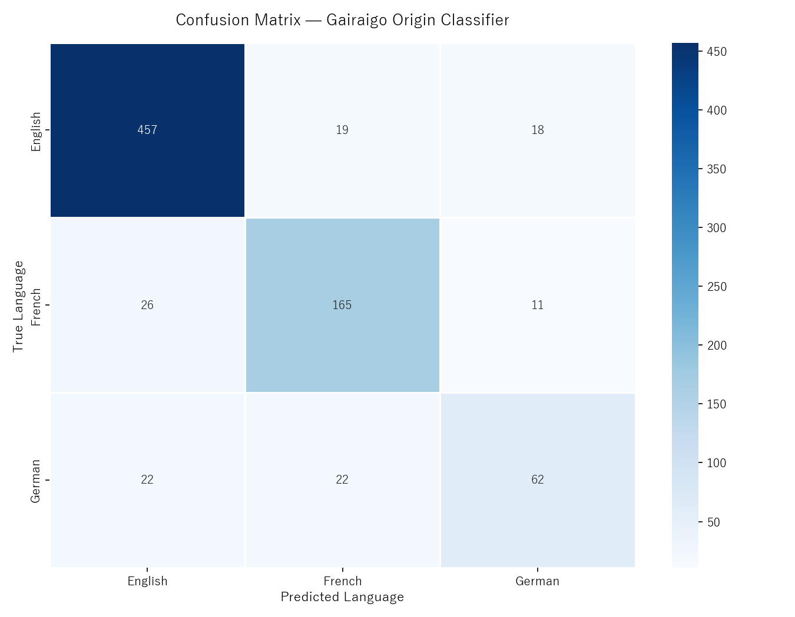
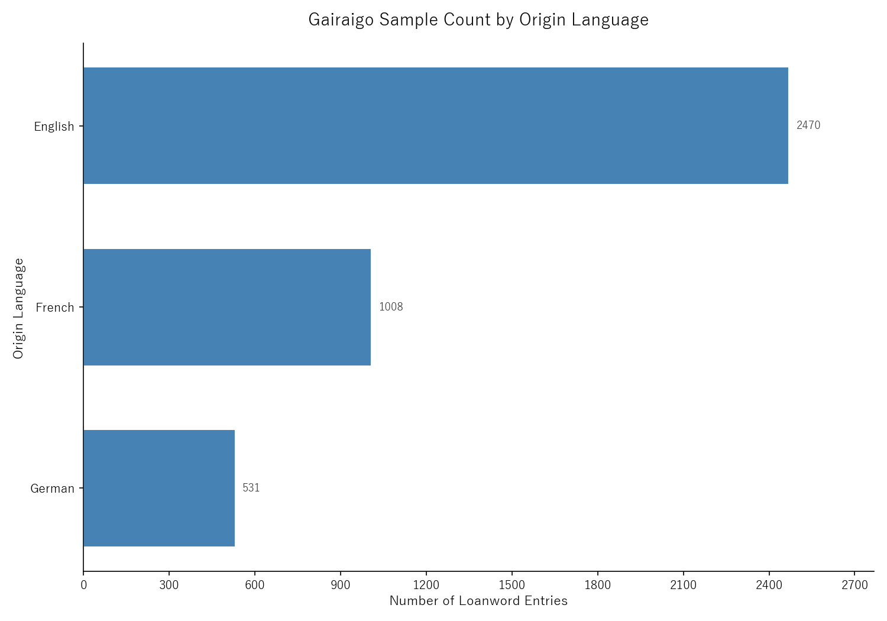
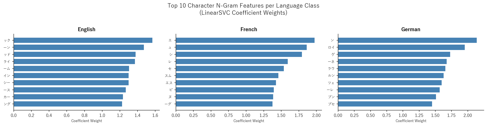

<a id="readme-top"></a>

<div align="center">
  <h1>Gairaigo Origin Classifier</h1>
  <p align="center">
    A machine learning pipeline for classifying the donor language of Japanese katakana loanwords (外来語)
    <br />
    <a href="https://drive.google.com/file/d/1jwD38TvuYH-NhQModb00Q4tixBcPIpG1/view?usp=sharing"><strong>Explore the report »</strong></a>
  </p>
</div>

## Overview

This project is for CTTC Data Science Technical Report. It trains a Linear Support Vector Classifier (LinearSVC) to predict the donor language of Japanese loanwords (gairaigo, 外来語) written in katakana, using character-level n-gram TF-IDF features extracted from the [JMdict](https://www.edrdg.org/wiki/index.php/JMdict-EDICT_Dictionary_Project) multilingual electronic dictionary. The classifier distinguishes loanwords originating from English, French, and German — the three European donor languages with the most historically significant and phonologically distinct presence in the Japanese lexicon. The pipeline covers the full ML workflow: loading, preprocessing, feature extraction, training, evaluation, visualization, and interactive prediction.

## Dataset

| Field | Details |
|---|---|
| Source | [JMdict/EDICT — Electronic Dictionary Research and Development Group](https://www.edrdg.org/wiki/index.php/JMdict-EDICT_Dictionary_Project) |
| Format | XML with `<lsource>` tags carrying ISO 639-2 donor language codes |
| Raw entries | 6,108 gairaigo entries across 79 donor languages |
| Filtered entries | 4,009 entries after class filtering (English, French, German only) |
| Train / Test split | 80% / 20% stratified |

## Dependencies

| Package | Purpose |
|---|---|
| `lxml` | XML parsing of the JMdict file |
| `pandas` | Data loading, cleaning, and tabular operations |
| `scikit-learn` | TF-IDF vectorization, LinearSVC training, and evaluation metrics |
| `matplotlib` | Chart rendering and figure export |
| `seaborn` | Statistical chart styling |
| `joblib` | Model artifact serialization |

## Project Structure

```
gairaigo_origin/
├── data/
│   └── JMdict                          # JMdict XML dictionary file (place here before running)
├── models/
│   ├── model.joblib                    # Saved LinearSVC classifier
│   ├── vectorizer.joblib               # Saved TF-IDF vectorizer
│   └── encoder.joblib                  # Saved LabelEncoder
├── output/
│   ├── plots/
│   │   ├── class_distribution.png      # Bar chart of class sample counts
│   │   ├── confusion_matrix.png        # Heatmap of test set predictions
│   │   └── top_features.png            # Top discriminative n-gram features per class
│   └── results/
│       └── classified_loanwords.csv    # Per-word predictions on the test set
├── scripts/
│   ├── train.py                        # Standalone training script — saves model artifacts
│   └── predict.py                      # Interactive prediction using saved artifacts
├── src/
│   ├── __init__.py
│   ├── constants.py                    # ISO 639-2 code to language name mapping
│   ├── loader.py                       # JMdict XML parser and gairaigo extractor
│   ├── preprocessor.py                 # Deduplication, class filtering, and TF-IDF featurization
│   ├── trainer.py                      # Train/test split and LinearSVC training
│   ├── evaluator.py                    # Accuracy, F1, and confusion matrix computation
│   └── visualizer.py                   # All chart generation (matplotlib + seaborn)
├── main.py                             # Entry point — runs the full pipeline end-to-end
└── requirements.txt
```

## Pipeline

The pipeline runs in eight sequential steps, all orchestrated from `main.py`.

**Step 1: Load** — `loader.py` parses the JMdict XML file and extracts entries that contain an `<lsource>` tag and a pure-katakana written form. The donor language code is read from the `xml:lang` attribute of `<lsource>`, defaulting to English when the attribute is absent (JMdict convention).

**Step 2: Preprocess** — `preprocessor.py` deduplicates exact (katakana, language) pairs, filters the dataset to retain only entries from the three target donor languages (English, French, German), decodes ISO 639-2 codes to full language names, and encodes labels as integers for scikit-learn.

**Step 3: Featurize** — `preprocessor.py` transforms each katakana string into a sparse TF-IDF feature vector using character n-grams (n = 2 to 4) in `char_wb` mode, which preserves word boundary information. Sublinear TF scaling is applied and n-grams appearing in fewer than two words are discarded.

**Step 4: Split** — `trainer.py` performs a stratified 80/20 train/test split, preserving class proportions across both partitions.

**Step 5: Train** — `trainer.py` fits a LinearSVC with `class_weight='balanced'` on the training set to compensate for class imbalance.

**Step 6: Evaluate** — `evaluator.py` computes overall accuracy, per-class precision, recall, and F1-score, and a confusion matrix on the held-out test set.

**Step 7: Visualize** — `visualizer.py` generates three charts and saves them to `output/plots/`.

**Step 8: Export** — `main.py` writes per-word predictions with true and predicted labels to `output/results/classified_loanwords.csv`.

## Results

The classifier achieved an overall accuracy of **85.29%** and a weighted F1-score of **0.85** on the held-out test set.

| Language | Precision | Recall | F1-Score | Support |
|----------|-----------|--------|----------|---------|
| English  | 0.90      | 0.93   | 0.91     | 494     |
| French   | 0.80      | 0.82   | 0.81     | 202     |
| German   | 0.68      | 0.58   | 0.63     | 106     |
| **Weighted Avg.** | **0.85** | **0.85** | **0.85** | **802** |

## Visualizations

### Confusion Matrix


### Class Distribution


### Top Discriminative Features


## Setup and Usage

### Prerequisites

- Python 3.11+
- A Japanese-compatible system font (Meiryo, MS Gothic, or Yu Gothic) for rendering katakana labels in charts

### Installation

```bash
git clone https://github.com/krislette/gairaigo-origin.git
cd gairaigo-origin
pip install lxml pandas scikit-learn matplotlib seaborn joblib
```

### Download the Dataset

Download JMdict from the Electronic Dictionary Research and Development Group and place the file in the `data/` directory:

https://www.edrdg.org/wiki/index.php/JMdict-EDICT_Dictionary_Project

After downloading, your `data/` folder should contain:

```
data/
└── JMdict
```

### Run the Full Pipeline

```bash
python main.py
```

All outputs (charts and CSV) will be saved to the `output/` directory.

### Train and Save Model Artifacts Only

```bash
python -m scripts.train
```

Saves `model.joblib`, `vectorizer.joblib`, and `encoder.joblib` to `models/`.

### Predict Interactively

```bash
python -m scripts.predict
```

Loads the saved model artifacts and launches an interactive prompt. Enter katakana words space-separated to classify them:

```
>> アルバイト コーヒー テレビ
  アルバイト   German
  コーヒー     English
  テレビ       English
```

You can also pass words directly as arguments:

```bash
python -m scripts.predict アルバイト コーヒー テレビ
```

## License

This project is for academic use. JMdict is distributed under the [Creative Commons Attribution-ShareAlike 4.0 International License](https://creativecommons.org/licenses/by-sa/4.0/) by the Electronic Dictionary Research and Development Group.

<p align="right">[<a href="#readme-top">Back to top</a>]</p>
